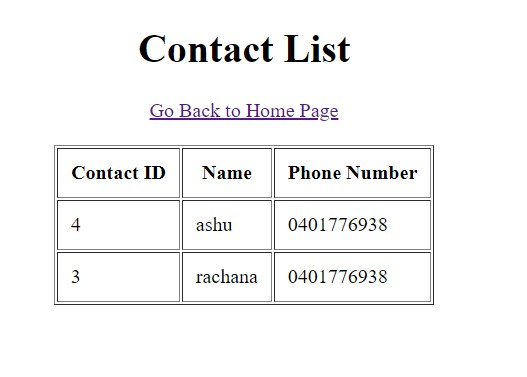

**Technologies Used**

| Java 8 , springboot,springmvc, h2 database, thymeleaf,tomcat |
| --- |

**How To Run**

1. Download code zip from[https://github.com/rachanaSane/AddressBook](https://github.com/rachanaSane/AddressBook)
2. Import code into your favourite editor (eclipse/intellij)
3. Open class pwc.au.book.AddressBookApplication , right click class and run as javaApplication.
4. Open URL [http://localhost:8080/](http://localhost:8080/)

**Assumptions**

- This is a web application with in memory database. No default values are present.
- Address Book name should be unique
- While comparing address books, names are case sensitive.
- Contact Name inside Address book need not be unique.
- only 2 address books could be compared. But code is written such a way that it could be extended if required to support multiple address books.
-  Search for unique contact names across address books is case sensitive.

**Things could have improved**

There are several things which could have been improved. But I tried to complete within 8 hours hence remaining.

- Better test coverage.
- Adding feature to support no same contact name within one address book
- Generic Error handling with custom exception classes.
- Introducing service layer in between controllers and repositories
- Better css classes for frontend, better structure
- Better UI features like ability to select from existing address books while comparing

**Some screenshots**

 

**Challenge**

You have been asked to develop an address book that allows a user to store (between

successive runs of the program) the name and phone numbers of their friends, with the

following functionality:

- To be able to display the list of friends and their corresponding phone numbers sorted by their name.
- Given another address book that may or may not contain the same friends, display the list of friends that are unique to each address book (the union of all the relative complements). For example given:

Book1 = { &quot;Bob&quot;, &quot;Mary&quot;, &quot;Jane&quot; }

Book2 = { &quot;Mary&quot;, &quot;John&quot;, &quot;Jane&quot; }

The friends that are unique to each address book are:

Book1 \ Book2 = { &quot;Bob&quot;, &quot;John&quot; }
